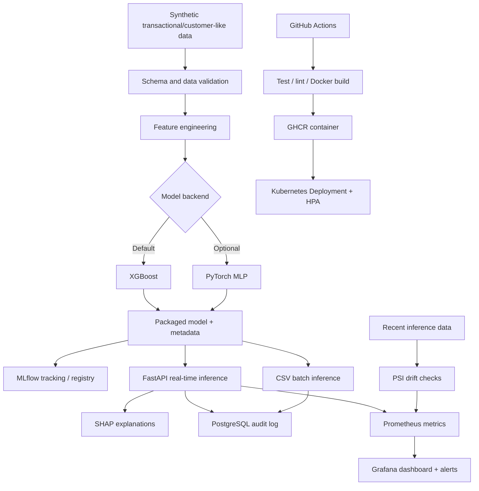

# Enterprise AI Risk Decision Platform

## Run the live portfolio demo on Render

This repository includes a memory-conscious free-tier deployment profile (`render.yaml`) for the interactive FastAPI/XGBoost demo. The hosted runtime uses XGBoost native Tree-SHAP contributions, SQLite audit logging and Prometheus-compatible metrics, while the full repository retains the PyTorch, MLflow, Docker, Kubernetes, PostgreSQL, Grafana/Prometheus and OpenTelemetry reference architecture.

[](https://render.com/deploy?repo=https://github.com/mpetalcorin/enterprise-ai-risk-decision-platform)

See [`DEPLOY_RENDER.md`](DEPLOY_RENDER.md) for the free-tier limitations and deployment notes.


A production-oriented, industry-neutral reference implementation for **governed machine-learning risk decisions**. It demonstrates the engineering path from a data-science proof of concept to a reusable AI service with model packaging, API serving, batch inference, explainability, audit logging, monitoring, drift checks, CI/CD, containers and Kubernetes.

> **Portfolio / demonstration system:** the included dataset is entirely synthetic and the decision labels are simulated. This project is not a credit, fraud, AML, customer eligibility, or regulatory decision system and must not be used for real-world financial decisions without domain-specific validation, controls, legal review and model-risk governance.

## Architecture



## What this repository demonstrates

- **Production API:** FastAPI endpoints for single and batch prediction, readiness/liveness endpoints, API-key control and structured JSON logs.
- **Two model paths:** XGBoost by default and an optional PyTorch multilayer perceptron.
- **Imbalanced classification:** class weighting is applied during training and evaluated with ROC-AUC, average precision and Brier score.
- **Explainable AI:** SHAP TreeExplainer provides per-prediction top drivers for the XGBoost path.
- **MLOps:** packaged/versioned model artifacts, MLflow experiment tracking and registry integration, GitHub Actions testing/build and release-to-GHCR workflow.
- **Data quality:** required-schema, null, domain and binary-field validation before training or batch scoring.
- **Auditability:** SQLAlchemy audit records capture request ID, timestamp, model version, input hash, score, decision and latency while deliberately avoiding persistence of raw payloads.
- **Observability:** structured JSON logs, Prometheus counters/histograms/gauges, OpenTelemetry trace export, Grafana dashboards, Tempo trace storage and example alerts.
- **Drift monitoring:** Population Stability Index (PSI) by engineered feature, with stable/watch/drift thresholds.
- **Container orchestration:** Docker Compose for the complete local stack and Kubernetes manifests with rolling deployment, health probes, resource requests/limits and HPA.
- **Real-time + batch inference:** REST endpoints and a CSV CLI workflow use the same packaged model and feature implementation.

## Repository layout

```text
.
├── .github/workflows/        # CI and tagged container-release workflows
├── k8s/                      # Kubernetes deployment/service/HPA/CronJob examples
├── monitoring/               # Prometheus config, alerts, Grafana provisioning/dashboard
├── scripts/                  # Bootstrap and demo calls
├── src/risk_platform/
│   ├── api/                  # FastAPI application and auth dependency
│   ├── audit/                # PostgreSQL/SQLite audit repository
│   ├── data/                 # Synthetic data and validation
│   ├── explainability/       # SHAP integration
│   ├── features/             # Shared feature engineering
│   ├── models/               # XGBoost/PyTorch training, loading, MLflow registration
│   └── monitoring/           # Prometheus metrics and PSI drift
└── tests/                    # Unit/API tests
```

## Quick start, Python

Requires Python 3.11+.

```bash
python -m venv .venv
source .venv/bin/activate
python -m pip install --upgrade pip
pip install -e '.[dev]'

python -m risk_platform.cli generate --rows 10000 --output data/transactions.csv
python -m risk_platform.cli train --data data/transactions.csv --backend xgboost --output models/risk_model.joblib
pytest -q
uvicorn risk_platform.api.main:app --host 0.0.0.0 --port 8000
```

The local default uses SQLite for audit records and does not require an API key. Open `http://localhost:8000/docs` for the generated OpenAPI interface.

### Real-time inference

```bash
curl -X POST http://localhost:8000/v1/predict \
  -H 'Content-Type: application/json' \
  -d '{
    "transaction": {
      "transaction_amount": 2400,
      "account_age_days": 38,
      "transactions_24h": 17,
      "avg_amount_30d": 145,
      "international": 1,
      "high_risk_country": 1,
      "device_new": 1,
      "failed_logins_24h": 3,
      "transaction_hour": 2,
      "customer_tenure_years": 0.1
    },
    "explain": true
  }'
```

Example response shape:

```json
{
  "request_id": "...",
  "risk_probability": 0.91,
  "risk_band": "high",
  "decision": "manual_review",
  "threshold": 0.65,
  "model_backend": "xgboost",
  "model_version": "...",
  "top_drivers": [
    {"feature": "high_risk_country", "contribution": 1.2, "direction": "increases_risk"}
  ]
}
```

### Batch inference

```bash
python -m risk_platform.cli batch \
  --input data/transactions.csv \
  --output reports/batch_predictions.csv
```

Both modes call the same feature and model code, reducing training-serving skew.

## Full local MLOps stack with Docker Compose

```bash
cp .env.example .env
# Change API_KEY and GRAFANA_PASSWORD before shared use.
docker compose up --build
```

Services:

| Service | URL | Purpose |
|---|---|---|
| Risk API | `http://localhost:8000` | Real-time and batch REST inference |
| API docs | `http://localhost:8000/docs` | OpenAPI/Swagger UI |
| MLflow | `http://localhost:5000` | Experiment/model lifecycle UI |
| Prometheus | `http://localhost:9090` | Metrics and alert evaluation |
| Grafana | `http://localhost:3000` | Operational dashboard and trace exploration |
| Tempo | `http://localhost:3200` | OpenTelemetry trace backend |
| PostgreSQL | internal only | Audit and MLflow metadata store |

The one-off `trainer` container creates synthetic data, trains XGBoost, packages the artifact and registers it as an MLflow **candidate** before the API starts. Promotion to `champion` is intentionally a separate approval action.

## Optional PyTorch model

```bash
python -m risk_platform.cli train \
  --data data/transactions.csv \
  --backend pytorch \
  --output models/risk_model_pytorch.joblib
```

Set `MODEL_PATH` to that artifact before starting the API. SHAP explanations are enabled for XGBoost; the PyTorch path deliberately returns no SHAP drivers rather than presenting an unvalidated explanation method.

## Model evaluation and governance metadata

Training packages the following alongside the estimator:

- backend and model version,
- exact engineered feature list,
- decision threshold,
- training and test row counts,
- observed class prevalence,
- ROC-AUC,
- average precision,
- Brier score,
- reproducibility seed,
- drift baseline distributions.

The model version is a deterministic hash of the training metadata. In an enterprise environment, this would normally be combined with source commit, image digest, training data snapshot/version, approval status and model registry lineage.

## Drift monitoring

A PSI baseline is stored at training time. Run:

```bash
python -m risk_platform.cli drift \
  --input data/transactions.csv \
  --model models/risk_model.joblib \
  --output reports/drift_report.json
```

Interpretation used in this demonstration:

- PSI < 0.10: stable,
- 0.10 <= PSI < 0.25: watch,
- PSI >= 0.25: drift.

These are operational demonstration thresholds, not universal statistical rules. A production governance process should calibrate thresholds to the use case and investigate outcome/performance drift separately from covariate drift.

## Audit design

Every prediction attempts to create an audit record containing:

- request UUID,
- timestamp,
- model backend and version,
- SHA-256 hash of the canonicalized input,
- predicted probability,
- decision,
- inference latency.

The reference implementation intentionally **does not persist the raw request body**. This reduces unnecessary retention of potentially sensitive input data while keeping a linkage mechanism for a governed upstream record system.

## Kubernetes

1. Build/push the container to your registry.
2. Replace `ghcr.io/OWNER/...` in `k8s/*.yaml`.
3. Copy `k8s/secret.example.yaml` to a secure secret-management workflow; do not commit real secrets.
4. Deploy PostgreSQL and MLflow, train/register a `candidate`, validate it, then explicitly promote the approved version to the `champion` alias.
5. Deploy the API; its init container fetches `champion` before the pod becomes ready.

```bash
kubectl apply -f k8s/namespace.yaml
kubectl apply -f k8s/secret.example.yaml   # demo only: replace values first
kubectl apply -f k8s/configmap.yaml
kubectl apply -f k8s/postgres.yaml
kubectl apply -f k8s/mlflow.yaml
# After registering/validating a candidate:
python scripts/promote_model.py --tracking-uri http://<mlflow-host>:5000 --version <approved-version>
kubectl apply -f k8s/api-deployment.yaml
kubectl apply -f k8s/api-service.yaml
kubectl apply -f k8s/hpa.yaml
```

The Kubernetes API uses an init container to fetch the MLflow `champion` alias into a shared model volume before serving traffic. This makes model promotion distinct from image release and prevents an unapproved training run from silently becoming production. The deployment also demonstrates rolling updates, readiness/liveness probes, resource controls and autoscaling. In a real bank environment, use managed PostgreSQL/object storage, a managed secrets service, network policies, private registry, ingress authentication/TLS, pod security standards, workload identity, central logs/traces, backup/restore and approved platform templates.

## CI/CD lifecycle

`ci.yml` executes on pushes and pull requests:

```text
checkout
  → install
  → lint
  → unit/API tests + coverage
  → synthetic integration dataset
  → model training smoke test
  → drift smoke test
  → Docker image build
```

`release.yml` executes on version tags (`v*`) and publishes an immutable tagged image plus `latest` to GitHub Container Registry. A regulated production environment should add manual approval/promotion gates, signed images/SBOMs, SAST/container scanning and automated rollback criteria.

## API endpoints

| Method | Endpoint | Description |
|---|---|---|
| GET | `/health` | Process liveness |
| GET | `/ready` | Model/database runtime readiness |
| GET | `/metrics` | Prometheus metrics |
| GET | `/v1/model` | Packaged model metadata |
| POST | `/v1/predict` | Real-time single-transaction inference |
| POST | `/v1/predict/batch` | JSON batch inference, up to 5,000 rows/request |

## Security and responsible-use notes

This is a portfolio reference architecture, not a bank production system. Before real deployment, at minimum add organization-approved identity and access management, TLS/mTLS, secrets rotation, encryption and key management, network segmentation, dependency/container scanning, rate limiting, data minimization, retention controls, fairness testing, adversarial/abuse testing, change approval, incident runbooks, human-review controls and independent model validation.

The API decision is intentionally `approve` versus `manual_review`, not an irreversible adverse action. A human-governed review path is a safer demonstration of how an ML score can support rather than silently replace accountable decision-making.

## Why this is useful as a Senior ML Scientist / MLOps portfolio project

The repository explicitly demonstrates the skills usually hidden by notebook-only portfolios: packaging, interfaces, input contracts, testing, deployment, release automation, service health, observability, model/data drift, explainability, databases, audit trails, rollback-ready containerization and repeatable batch/online inference.

## Production-readiness evidence

- [`MODEL_CARD.md`](MODEL_CARD.md), intended use, benchmark evidence, limitations and monitoring.
- [`docs/NON_FUNCTIONAL_REQUIREMENTS.md`](docs/NON_FUNCTIONAL_REQUIREMENTS.md), availability, performance, security, observability and cost expectations.
- [`docs/MODEL_GOVERNANCE.md`](docs/MODEL_GOVERNANCE.md), candidate-to-champion approval and rollback evidence.
- [`docs/RUNBOOK.md`](docs/RUNBOOK.md), operational triage and rollback procedures.
- [`SECURITY.md`](SECURITY.md), included controls and production hardening requirements.

## License

MIT. Synthetic data only.
